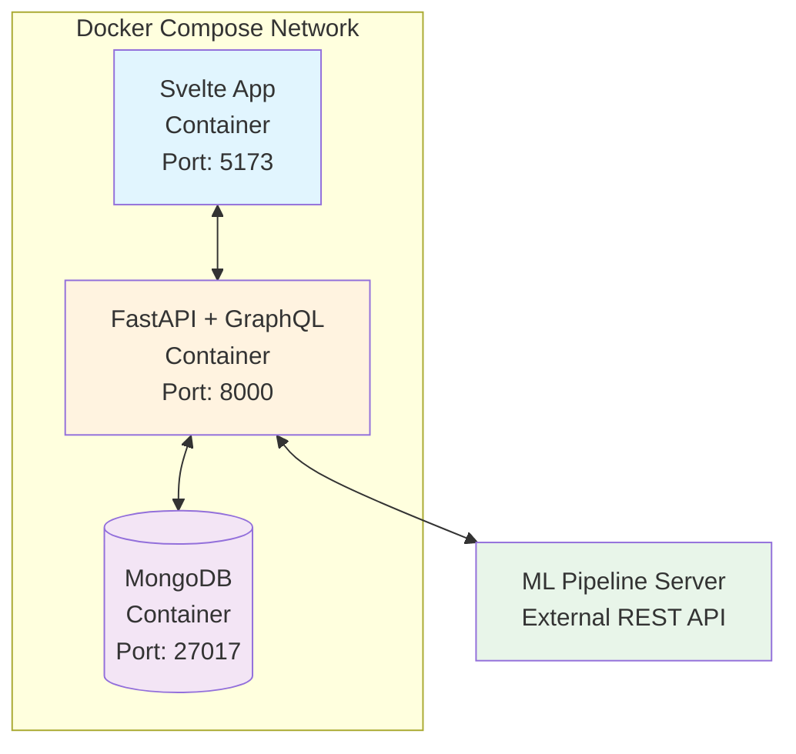
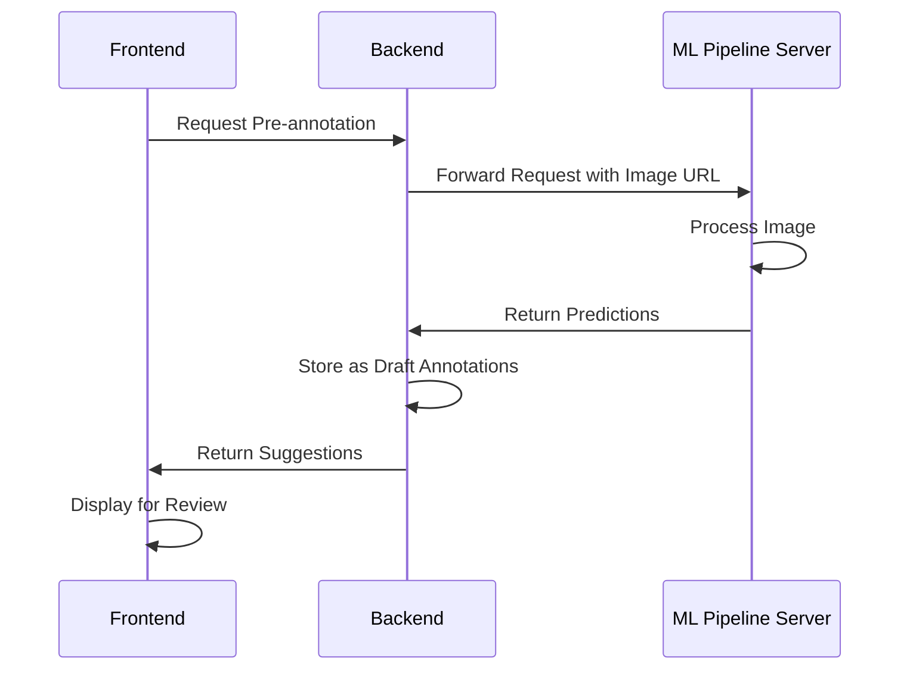
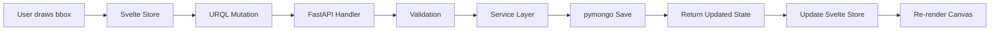
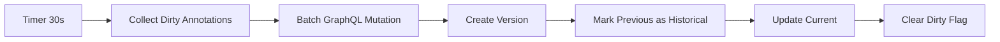
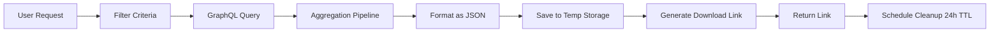

# Image Annotation Tool - System Architecture

## Executive Summary
A modular monolith architecture for an ML data annotation tool, built with Svelte (frontend) and FastAPI/Strawberry GraphQL (backend), deployed via Docker Compose.

## System Architecture Overview

### Architecture Style
**Modular Monolith** - Single deployable unit with well-separated internal modules

## Technology Stack

### Frontend
- **Framework**: Svelte 5 with SvelteKit
- **Canvas Library**: Konva.js for annotation rendering
- **State Management**: Svelte stores
- **GraphQL Client**: URQL
- **Build Tool**: Vite
- **Package Manager**: pnpm
- **UI Components**: Custom components + Tailwind CSS
- **Image Loading**: Native browser with CORS handling
- **Development Port**: 5173

### Backend
- **Framework**: FastAPI (Python 3.11+)
- **GraphQL**: Strawberry GraphQL
- **Database Driver**: pymongo (synchronous MongoDB driver)
- **Validation**: Pydantic v2
- **CORS**: FastAPI CORS Middleware
- **Package Manager**: uv
- **File Handling**: Temporary file storage with TTL
- **Development Port**: 8000

### Database
- **Primary Database**: MongoDB 7.0
- **Collections**:
  - `images` - Image URLs and metadata
  - `annotations` - Bounding boxes with versioning
  - `tags` - Hierarchical tag taxonomy
  - `export_jobs` - Export history and temporary files
  - `ml_jobs` - ML pipeline job tracking

### Infrastructure
- **Containerization**: Docker
- **Orchestration**: Docker Compose
- **Volumes**: MongoDB data persistence, temporary export storage
- **Networks**: Bridge network for container communication
- **CI/CD**: GitHub Actions for testing and building

## Module Architecture

### Backend Module Organization
The backend follows a layered architecture with clear separation of concerns:

- **API Layer**: FastAPI app initialization and configuration
- **GraphQL Layer**: Schema definitions with queries and mutations
- **Service Layer**: Business logic and orchestration
- **Repository Layer**: Data access abstraction with pymongo
- **Model Layer**: Pydantic models for validation and serialization
- **Utility Layer**: Shared validators and converters

### Frontend Module Organization
The frontend uses a component-based architecture:

- **Routes**: SvelteKit file-based routing for navigation
- **Components**: Reusable UI components organized by feature
- **Stores**: Centralized state management using Svelte stores
- **GraphQL Client**: URQL client configuration and operations
- **Utilities**: Helper functions for canvas operations and keyboard handling

## API Design

### GraphQL API
The primary API uses GraphQL for flexible data fetching:

- **Queries**: Image retrieval, annotation history, tag hierarchy
- **Mutations**: CRUD operations for images, annotations, and tags
- **Subscriptions**: Placeholder for future real-time updates

### REST Endpoints
Supplementary REST endpoints for specific operations:

- ML pipeline integration
- File export/download
- Bulk import operations
- Health checks

## Data Models

### Images Collection
Stores image URLs with metadata including dimensions, format, status tracking, and references to annotation versions. Images are never stored directly, only their URLs.

### Annotations Collection
Implements versioning system where each save creates a new version. Contains bounding boxes with coordinates, multiple tags, free-text descriptions, ML-generated descriptions, confidence scores, and source tracking (manual vs ML).

### Tags Collection
Hierarchical structure supporting unlimited depth with parent-child relationships, usage counting, and full path storage for efficient querying.

## ML Pipeline Integration

### Integration Architecture
External ML services communicate via REST API with request-response pattern. The system sends image URLs to ML endpoints and receives predictions containing bounding boxes, tags, descriptions, and confidence scores.

### Error Handling
Graceful degradation when ML services are unavailable, with timeout management and fallback to manual annotation.

## Data Flow Patterns

### Annotation Creation Flow

### Auto-save Flow

### Export Flow

## Deployment Architecture

### Container Strategy
Three-container setup orchestrated with Docker Compose:

1. **Frontend Container**: Serves Svelte application
2. **Backend Container**: Runs FastAPI application with Uvicorn
3. **MongoDB Container**: Provides database persistence

### Volume Management
- MongoDB data volume for database persistence
- Export data volume for temporary file storage
- Source code volumes for development hot-reloading

### Network Configuration
Single bridge network enabling container-to-container communication with service discovery by container name.

## Development Workflow

### Local Development Setup
- Docker Compose for service orchestration
- Hot-reload enabled for both frontend and backend
- Tests run locally for faster feedback
- Separate development and test databases

### Testing Strategy
- Unit tests for individual components and services
- Integration tests for API endpoints
- Frontend component testing with Vitest
- Local test execution with MongoDB test instance

### Build Process
- uv for Python dependency management and packaging
- pnpm for Node.js dependency management
- Multi-stage Docker builds for optimized images
- GitHub Actions for automated CI pipeline

## Performance Considerations

### Frontend Optimization
- Canvas layer management for efficient redrawing
- Lazy loading for images with intersection observer
- Debounced auto-save to reduce API calls
- Code splitting with dynamic imports
- URQL cache configuration for query optimization

### Backend Optimization
- Database indexing strategy for common queries
- Connection pooling configuration
- Cursor-based pagination for large datasets
- MongoDB aggregation pipelines for complex queries
- In-memory caching for frequently accessed data

### Scalability Strategy
1. **Phase 1**: Current modular monolith for single user
2. **Phase 2**: Redis integration for caching and sessions
3. **Phase 3**: ML integration extraction as microservice
4. **Phase 4**: Async job queues for heavy processing
5. **Phase 5**: Multi-user support with authentication

## Security Considerations

### Current Security Measures
- Input validation on all endpoints
- Parameterized database queries
- CORS configuration for known origins
- JSON-only file uploads for imports
- URL validation for image sources

### Future Security Enhancements
- JWT-based authentication system
- Rate limiting per endpoint
- API key management for ML services
- Comprehensive audit logging
- Data encryption at rest

## Monitoring & Observability

### Logging Strategy
- Structured logging with contextual information
- Log levels: DEBUG, INFO, WARNING, ERROR, CRITICAL
- Centralized log aggregation (future enhancement)
- Request/response logging for debugging

### Metrics Collection
- API response time tracking
- Annotation save frequency monitoring
- ML pipeline success rate measurement
- Export job completion tracking
- Database query performance analysis

### Health Monitoring
- Application health check endpoints
- Database connectivity monitoring
- ML pipeline availability checking
- Resource utilization tracking

## Configuration Management

### Environment Variables
Separate configuration for development, testing, and production environments with settings for database connections, ML pipeline endpoints, export TTL, and feature flags.

### Secret Management
Currently using environment variables, with plans for dedicated secret management service in future phases.

## Success Metrics
- Page load time under 2 seconds
- Annotation save latency under 500ms
- Support for 500+ annotations per image
- 99.9% uptime within VPN environment
- Zero data loss through versioning system
- 40% reduction in annotation time with ML assistance
